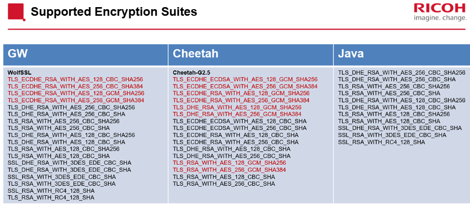

<H3>Módulo: 18S GW Controller Technical Training:

<h4>AULA 01(Introdução):

- Ao Finaldo módulo você será capaz:
   -  Identificar os recursos de rede
   -  Examinar as configurações de segurança
   -  Descobrir as atualizações do sistema
   -  Analisar as mudanças em relação à digitalização, impressão e fax
   -  Descobrir as ferramentas de suporte inteligentes da Ricoh
   -  Resumir processo A.C.T. (Always Current Technology)

- O controlador 18S é a versão mais recente do controlador principal GW para dispositivos multifuncionais

<h4>AULA 02(Network):

-  Device Server Option type M37
   -  O DSOT-M37 fornece uma interface de rede secundária para ambientes com várias redes.
   
   <table>
         
         Fornece capacidade de impressão
         Suporta SNMP
         Configuração de rede personalizada
      
         Digitalização não suportada

   </table>

<h4> Protocolos:

   -  NetBIOS
      -  Network Basic Input/Output System
      -  Opera na porta TCP 139
      -  Atribui um nome aos dispositivos de rede e permite a comunicação do dispoitivo

   -  DHCPv6
      -  Dynamic Host Configuration Protocol(para IPv6 networks)
      -  Opera na porta TCP 546 e 547
      -  Atribui automaticamente informações de rede, como endereço IPv6

   -  DHCP
      -  Dynamic Host Configuration Protocol
      -  Opera na porta TCP 67 e 68
      -  Atribui automaticamente informações de rede, como endereço IPv4
   
   -  MDNS(Bonjour)
      -  Multicast Domain Name System
      -  Resolve nomes de host para endereços IP em redes que não têm um servidor de nomes local
      -  Usa pacotes UDP na porta 5353

   -  LLMNR
      -  Link-Local Multicast Name Resolution
      -  Opera na porta UDP 5355
      -  Baseado no formato DNS
      -  Executa a resolução de nomes para hosts na mesma rede local sem a necessidade de um servidor DNS
   
   -  DirectPrint
      -  Imprime diretamente para impressoras dos celulares de clientes ou SO móvel

   -  LPR
      -  Line Printer Remote
      -  Também conhecido como LPD (Line Printer Daemon)
      -  Opera na porta 515
      -  Protocolo de rede para enviar trabalhos de impressão para uma impressora
   
   -  IPP
      -  Interner Printing Protocol
      -  Opera na porta TCP 631
      -  Comunicação entre clientes e impressoras, incluindo:
         -  Capacidade da impressora
         -  Submissão de jobs de impressão
         -  Obtenção do status de impressão do job
         -  Obtenção do status da impressora
         -  Cancelar jobs de impressão

   -  SNMP
      -  Simple Network Management Protocol
      -  Opera nas portas UDP 161 e 162
      -  Monitora e gerencia dispositivos de rede

   -  UPnP
      -  Universal Plug and Play
      -   Conjunto de protocolos que permitem aos dispositivos descobrir outros dispositivos na rede e estabelcer serviços entre eles

<h4>M37 differences vs Main Controller NIC

   -  WIM
      -  Não acessível através do Option Network Connection
      -  Os protocolos HTTP não são suportados. Utilize a NIC do controlador principal para configurar a NIC Opcional

   -  Telnet
      -  Não acessível através do Option Network Connection
      -  O protocolo Telnet não é suportado. Use a Main Controller NIC para configurar a NIC Opcional

   -  Hostname
      -  O registro de nome por Dynamic-DNS não é suportado
      -  Quando a Configuração do nome do host é sincronizada com a unidade principal(padrão), O nome do host não é adquirido do servidor DHCP

   -  NetBIOS
      -  O registro de nome por transmissão não é suportado 
      -   O julgamento duplicado do nome NetBIOS é feito somente quando o servidor WINS é registrado

   -  NBTD  
      -  O número máximo de caracteres para o ID de escopo adquirido do DHCP é 63 no NIC principal, mas o máximo dessa opção é 31 caracteres

   -  Access Control
      -  Há 5 escalas do controle de acesso no NIC principal, mas esta opção tem 4 escalas do controle de acesso

   -  LPD
      -  A especificação da opção não é suportada
      -  A exibição das informações do trabalho no LPQ é fixa em nenhuma entrada
      -  A exclusão da tarefa da fila de impressão não é suportada
      -  Tratar o nome da fila como LP(Opcional no lado da unidade principal)
      -  O spool não é suportado pelo corpo do controlador
      -   Ele não suporta o comando RECEIVE CONTROL FILE FIRST e RECEIVE DATA FILE WITH UNSPECIFIED LENGTH, que pode ser usado apenas pela AIX

   -  IPP
      -  O spool não é suportado pelo corpo do controlador
      -  AirPrint não é suportado
      -  IPPS não é suportado  
      -  Dados de impressão compactados não são suportados
      -  A pausa/retomada do trabalho de impressão não é suportada
      -  A autenticação IPP não é suportada
      -  A tarefa não pode ser cancelada após todos os dados terem sido recebidos

   -  SNMP v1/v2
      -  A função Trap não é suportada
      -  Definir comando não é suportado

   -  SNMP v3
      -  Existe apenas um tipo de conta
      -  A função Trap não é suportada
      -  A função de log de comunicação criptografada não é suportada
      -  Se acessado por SNMPv3 quando SNMPv3 é inválido, um erro de autenticaçãoé retornado em vez de nenhuma resposta
      -  A detecção de ataque não é suportada

   -  DIPRINT
      -  O spool não é suportado pelo corpo do controlador 
      -  O número máximo de sessões é diferente(Main = 8, Opcional = 9)
   

- Este controlador 18S permite selecionar o bandwidth(2.4GHz ou 5GHz)
   -  Para alterar o bandwidth usar Telnet

<h4>AULA 03(Security):

-  Controle de acesso

-  Restrição de funções de aplicativos

-  Configurações de exibição do aplicativo

-  Desativação de interfaces externas

-  Login Supervisor

-  Relatório de Apagamento de memória(Erase Memory)

<h4>A função de controle de acesso restrige o acesso por meio de um intervalo de IPs.

Os seguintes intens protocolos / itens são bloqueados por esta função: 

-  LPD

-  RCP/RSH

-  FTP

-  DIPRINT

-  IPP

-  Bonjour

-  SMB

-  HTTP & HTTPS

-  WS-MFP (WS-Device, WS-Printer , WS-Scanner)

-  IPDS

-  RHPP

-  SNMP(Novo para 18S)

-  Telnet(Novo para 18S)

-  NBT(Novo para 18S)

 A proteção por intervalo de IP usa telnet ou WIM protegendo de mecanismo de buscas como o SHODAN em uma pesquisa por dispositivos vulneráveis abertos ao público

-  No controlador 18S é possível restringir as funções disponíveis dentro de cada aplicativo, tais como imprimir unicamente em B&W em uma impressora color e escanear documento com determinados parâmetros

- Possibilidade de ocultar ou não determinada funcionalidade, deixando determinadas sem acesso a determinadas funcionalidades, este recurso pode ser ativado via WIM ou SOP

- Possível desativar Wi-Fi, Wireless Direct, Bluetooth, Screen SD Card Slot, Screen USB Memory Slot

<h4>Advanced Secutiry

-  Conjuntos de Criptografia

-  Configurações SSL/TLS

-  Conformidade RFC6056

-  Autenticação Kerberos

-  Os protocolos criptográficos abaixo estão sendo desativados por omissão:

   -  TLS1.0
   -  SSL 3.0
   -  3DES

