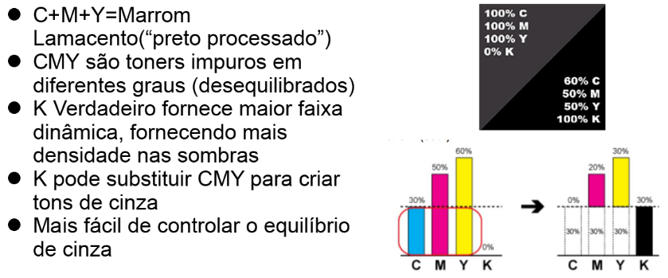
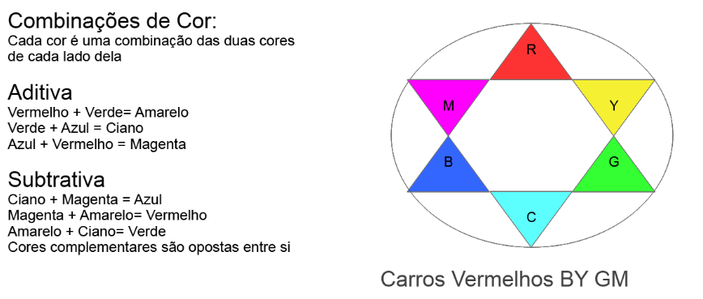
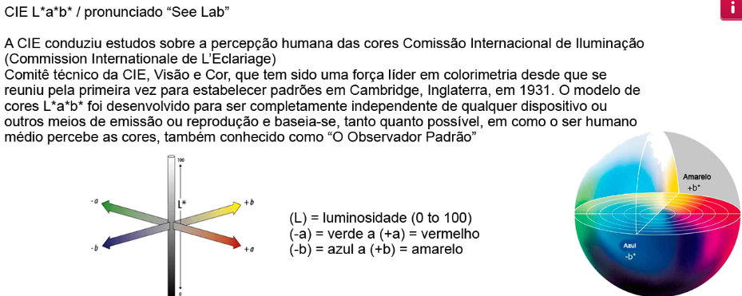
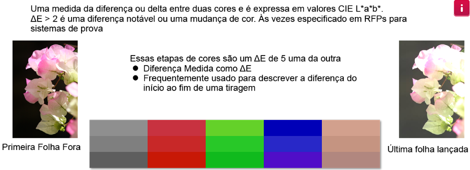

<H3>Módulo: Digital Color Basics Self Paced v3:

<h4>AULA 01(Introdução):

- Teoria das cores, por quê é importante?
   - Melhores relações de cores
   - Descobrir os requisitos de cores
   - Diagnosticar mudanças de cores
   - Manter credibilidade
   - Fundamentos de gestão de cor

- Termos e conceitos:

   <table>
      <tr>
         <td>Espectro</td>
         <td>Matiz, Valor, Saturação</td>
         <td>Quente/Frio</td>
         <td>Comprimentos de onda</td>
         Primárias aditivas (RGB)
         Primárias subtrativas (CMYK)
         Círculo Cromático
         Cores Complementares
         Tabela de consulta (LUT)
         Gama
         Espaços de Cor
         Compressão de Gama
      </tr>

      <tr>
         Tentativas de renderização
         Spectrofotometro
         Dispositivo Dependente
         Dispositivo Indenpendente
         CIE / CIE L Cor *a*b*
         gerenciamento de cor
         Perfis ICC
         DELTA E
         Cor Especial
         Cor Pantone
         RGB
         CMYK
      </tr>
 
   </table>

<h4>Luz Visível:

   - A cor é uma sensação visual causada pela luz(emissor) refletida por um objeto(refletor) que estimula receptores no olho que enviam sinais através do nervo óptico para o cérebro

   - Espectro eletromagnético

   - Comprimentos de ondas que variam de 380nm até 720nm

   - Refletância espectral
   
   - A reflexão contem os comprimentos de onda não absorvidos, contudo os receptores(nossos olhos) vêm a reflexão.

<h4>AULA 02( Visualizador de cores):

-  Daltonismo é causada por por falha no desenvolvimento dos cones da retina
   -  Ao olhar fixadamente para um espectro de cores RGB por X tempo vemos o espectro CMY num fundo branco

-  Questões de adjacência, causa impressão que objeto iguais em fundos de cores diferentes possuem tamanhos diferentes

-  Metamerismo é quando duas ou mais cores parecem idênticas sob determinada fonte de luz, mas que são diferentes para um outro observador ou fonte de luz

<h4>AULA 03(Modelos de cor):

-  Atributos físico
   - Comprimento de onda 380nm a 720nm

-  Atributos percetivos
   -  Matiz: nome da cor e temperatura

   -  Valor: claridade ou luminância

   -  Saturação: (croma) intensidade ou pureza(opaco vs rico)

<h4> Cor Aditiva RGB: 

<table>
   
      Sem luz = Preto
      100% RGB = Branco
      Luz Adicional = Luz mais clara

      Dispositivos que usam RGB

         Monitores
         Scanners
         Olho humano
         Câmeras Digitais
         Qualquer coisa que use luz
</table>

<h4> Cor Subtrativa CMYK: 

<table>
   
      100%CMY(+K) = Preto
         100% CMY = Marrom Lamacento(Preto Processado)
      Subtraindo Comprimentos de onda filtrando RGB do papel branco
      
      Dispositivos que usem CMYK
         Impressoras jato de tinta
         Impressoras a Laser
         Copiadoras coloridas
         Qualquer coisa que utilize toner ou tinta

</table>

<h3> Porquê preto: 

<h3> Roda de cores:

<h4>AULA 04(Gamas & Espaços de cor):

<h4> "Por que não consigo fazer com que a impressão corresponda ao meu monitor?" 

Como sabemos, os monitores são dispositivos RGB, e as impressoras são CMYK, mas isso não responde à pergunta
para isso temos que entender o que exatamente está acontecendo quando você imprime algo que é RGB e tem que ser convertido para a impressora CMYK?
Para os fins desta discussão, a resposta simples é o Fiery fica entre a entrada RGB do computador e faz a conversão para a 
Saída CMYK da impressora.

-  Gamut é a gama de cores reproduzíveis em um determinado dispositivo

-  Conversão RGB para CMYK

   -  Apresentação / Saturação 
   -  Perceptiva / Fotográfica
   -  Colorimétrica Relativa
   -  Colorimétrica 
   
-  Coisas que podem afetar as cores do seu monitor:

   -  Configuração de brilho
   -  Configuração de contraste
   -  Configuração de temperatura de cor
   -  Perfil de calibração do monitor
   -  Idade do monitor
   -  Modelo e marca
   -  Iluminação do Ambiente(sala)

-  Espaço de cores CMYK depende do dispositivo usado
   
-  Coisas que podem afetar a cor em sua impressora

   -  Calibração
   -  Perfil de saída
   -  Papel usado
   -  Idade da impressora
   -  Serviço técnico
   -  Iluminação do ambiente(sala)

<h4>Modelo CIE L*a*b*

-  Diagrama de cromaticidade
   -  Inclui todas as cores perceptíveis nos modelos RGB e CMYK
   -  Usado no Adobe photoshop, Illustrator, InDesign...

-  Para medições no CIE L * a * b *
   - Usar espectrofotometro   
      -  Mede as ondas de luz e fornece dados em valores CIE L * a * b * 
      -  Calibra e cria perfis customizados

-  Delta E

<h4>AULA 05(Cores Pantone SPOT):

-  Pantone é o fabricante de tintas de cores especiais mais popular nos EUA

   -  Misturado a partir de 13 pigmentos de base usando o pantone formula guide

   -  Amostras para revestido C, não revestido U, Fosco M, pastéis neon metálicos, etc...

   -  Identificado por um número ou nome(Pantone Reflex Blue, Pantone 186C)

*Impressoras digitais simulam cores exatas(Pantone) usando o CMYK*

***