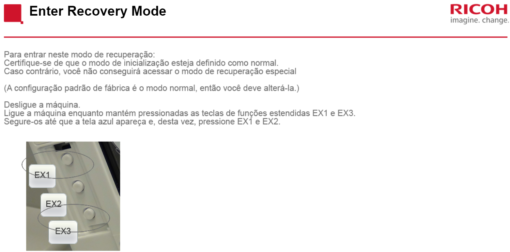
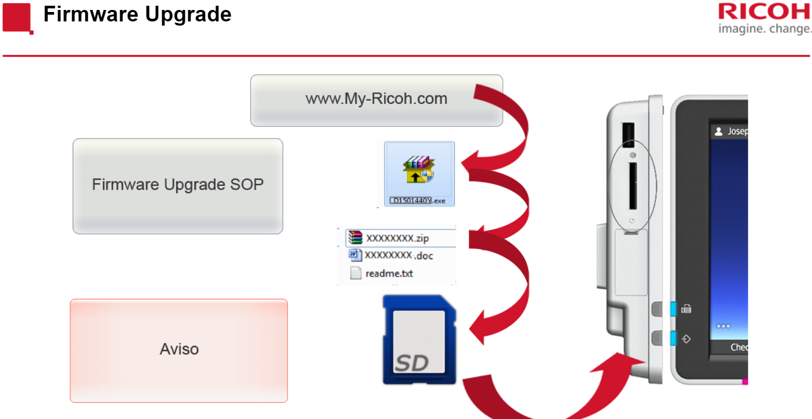
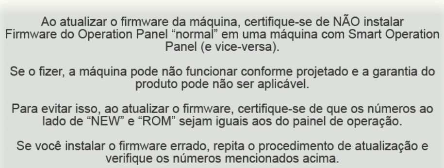
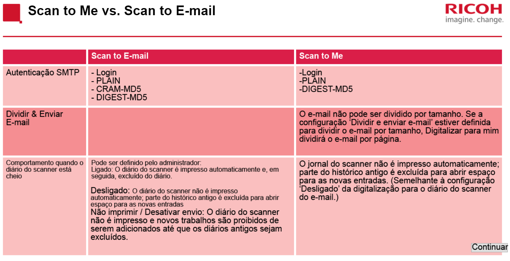

<H1>Treinamento Ricoh
<H2>Este repositório tem o intuito de conter anotações sobre o treinamento de impressoras da Ricoh.

<H3>Módulo: Smart Operation Panel V2 Self Paced Training:

<h4>AULA 01(Treinamento introdutório do Smart Operation Panel):

- Operação básicas do Smart Operation Panel(Funcionamento igual tablet)

- Possibilidade de mudança de Wallpaper

- Possibilidade de envio de documentos por Bluetooth e TF Card

- Possibilidade de usar Cartão para liberar impressão

- Uso de interfaces rápidas e interfaces clássicas.

- App de Suporte remoto fornece um ID a ser fornecido para estabelecer conexão

- Possibilidade de escanear documentos e salva-los em email ou em pasta compartilhada

- Configuração de Widgets

***

<h4>AULA 02(Treinamento do operador):

- Reassunto sobre os itens abordados na aula 01

- Função de prioridade de aplicativos e programas

- Explicações sobres Web Browsers 
   - Web Browser é usado para sites externos(SurfaceWeb)
   - Web Browser NX é usado para sites internos(ex: da companhia)
- Reset do Home Display retornará ao padrão de fábrica

***

<h4> Aula 03(Simulação):

- Simulação do uso do painel da impressora para caso não ter a disponibilidade de uma

***

<h4> Aula 04(Hardware):

- Mudanças da versão legado para a versão 2:
   - Customização da tela inicial por usuário
   - Autenticação por ID Card
- Desligamento correto do equipamento:
    
    1. Pressionar o botão de liga/desliga do equipamento
    2. Desconectar o equipamento da tomada
    3. Após as etapas anteriores pressionar o botão de liga/desliga do equipamento a fim de eliminar a tensão residual
- Hardware Overview(Substituição completa)
    1. Operation Panel
    2. CPU Board
    3. Micro Computer Board
    4. Alto-Falante
    5. Painel LCD
   - Após substituição dos itens do painel de operação verificar ações para cada item
   

   

- Recovery Mode / Modo de recuperação
   - Para atualização do firmware do painel entrar no modo Especial Recovery
    - Para entrar neste modo seguir passos da imagem abaixo
    

    

    - Processo de atualização do firmware
    

    
    - Aviso: 
    

- Após restauração alguns aplicativos como os de interface rápida serão instalados novamente contudo alguns deverão ser instalados via TF Card ou eDCi
    - TF Card(Cartão de memória)
    - eDCi(Servidor da fabricante fornecendo ProductKey) 

*** 

<h4> Aula 05(Conexão 1):

- Configuração de tela e dispositivo(App UserTools)

   - 1. User Tools
   - 2. Screen Features
   - 3. Screen Device Settings
   - 4. User's Own Customization
   - 5. Change the option to "Allow"
   - Possibilita o usuário personalizar sua tela inicial

-  Scan to Folder Helper possibilita escanamento com dispositivos que tiverem ao menos uma pasta compartilhada
-  Scan to Me deve estar com User Authetication habilitada
-  Overview:

- Web Browser salva páginas em pdf(Overview):

- Smart Operation Panel v2 tem autenticação por nfc(necessário habilitar leitor após instalação)

   - User Tools

   - Screen Features

   - Screen Device Settings

   - IC Card Software Settings

   - Select IC Card Reader

      - Proximity Card Reader

   - Proximity Card Reader Settings   
      - Enable checkbox Auth.

-  Quick Card Authethtication 
   - Use Authetication
   
   - Reboot the machine

- Overview de cartões compatíveis com o dispositivo

- Smart Device Connector (App to mobile devices printing)
      
   - Posibilidade de autenticação por QR Code

