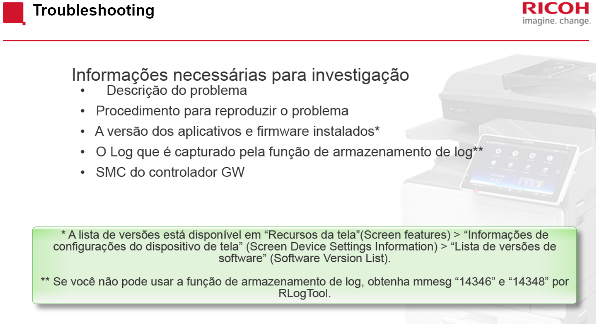

<H3>Módulo: Smart Operation Panel V2 Self Paced Training:

<h4>AULA 01(Treinamento introdutório do Smart Operation Panel):

- Operação básicas do Smart Operation Panel(Funcionamento igual tablet)

- Possibilidade de mudança de Wallpaper

- Possibilidade de envio de documentos por Bluetooth e TF Card

- Possibilidade de usar Cartão para liberar impressão

- Uso de interfaces rápidas e interfaces clássicas.

- App de Suporte remoto fornece um ID a ser fornecido para estabelecer conexão

- Possibilidade de escanear documentos e salva-los em email ou em pasta compartilhada

- Configuração de Widgets

***

<h4>AULA 02(Treinamento do operador):

- Reassunto sobre os itens abordados na aula 01

- Função de prioridade de aplicativos e programas

- Explicações sobres Web Browsers 
   - Web Browser é usado para sites externos(SurfaceWeb)
   - Web Browser NX é usado para sites internos(ex: da companhia)
- Reset do Home Display retornará ao padrão de fábrica

***

<h4> Aula 03(Simulação):

- Simulação do uso do painel da impressora para caso não ter a disponibilidade de uma

***

<h4> Aula 04(Hardware):

- Mudanças da versão legado para a versão 2:
   - Customização da tela inicial por usuário
   - Autenticação por ID Card
- Desligamento correto do equipamento:
    
    1. Pressionar o botão de liga/desliga do equipamento
    2. Desconectar o equipamento da tomada
    3. Após as etapas anteriores pressionar o botão de liga/desliga do equipamento a fim de eliminar a tensão residual
- Hardware Overview(Substituição completa)
    1. Operation Panel
    2. CPU Board
    3. Micro Computer Board
    4. Alto-Falante
    5. Painel LCD
   - Após substituição dos itens do painel de operação verificar ações para cada item
   

   

- Recovery Mode / Modo de recuperação
   - Para atualização do firmware do painel entrar no modo Especial Recovery
    - Para entrar neste modo seguir passos da imagem abaixo
    

    

    - Processo de atualização do firmware
    

    
    - Aviso: 
    

- Após restauração alguns aplicativos como os de interface rápida serão instalados novamente contudo alguns deverão ser instalados via TF Card ou eDCi
    - TF Card(Cartão de memória)
    - eDCi(Servidor da fabricante fornecendo ProductKey) 

*** 

<h4> Aula 05(Conexão 1):

- Configuração de tela e dispositivo(App UserTools)

   - 1. User Tools
   - 2. Screen Features
   - 3. Screen Device Settings
   - 4. User's Own Customization
   - 5. Change the option to "Allow"
   - Possibilita o usuário personalizar sua tela inicial

-  Scan to Folder Helper possibilita escanamento com dispositivos que tiverem ao menos uma pasta compartilhada
-  Scan to Me deve estar com User Authetication habilitada
-  Overview:

- Web Browser salva páginas em pdf(Overview):

- Smart Operation Panel v2 tem autenticação por nfc(necessário habilitar leitor após instalação)

   - User Tools

   - Screen Features

   - Screen Device Settings

   - IC Card Software Settings

   - Select IC Card Reader

      - Proximity Card Reader

   - Proximity Card Reader Settings   
      - Enable checkbox Auth.

-  Quick Card Authethtication 
   - Use Authetication
   
   - Reboot the machine

- Overview de cartões compatíveis com o dispositivo

- Smart Device Connector (App to mobile devices printing)
      
   - Posibilidade de autenticação por QR Code

*** 

<h4> Aula 06(Conexão 2):

- Conexão LAN através do Controlador GW

- Conexão LAN sem fio através do Smart Operation Panel v2

   - Conexão entre Smart Operation Panel v2 e dispositivo é criptografado usando WPA-PSK ou WPA2-PSK

   - Não é possível que os clientes se comuniquem entre diretamente um com o outro

   - Possibilidade de configuração do Wi-Fi Direct no Smart Operation Panel

      - Screen Features

      - Enable option "Screen Direct Connection Settings"

      - Enable the checkbox Direct Connection: Group Owner Mode
         - Quando habilitado comunicação Wi-Fi é automaticamente desligada

      - Após isso realizar conexão no dispositivo cliente 

   - Port Forwarding Overview:

- SmartSDK permite que desenvolvedores desenvolvam 3 tipos de aplicativos
   
   - Aplicação Remota
   
   - Aplicativo Web
   
   - Aplicativo para Smart Operation Panel

- SmartSDK Suporta os seguintes modos de operação

   - Modo Nativo

   - Modo Híbrido

   - Modo de compatibilidade

- Importar e exportar configurações pela Web

   - Digite o IP do dispositivo no navegador web do seu computador

   - Clicar em login e logar com as seguintes credenciais(para primeiro acesso)

      - Login: admin

      - Pass: 

   - Gerenciamento de dispositivos

      - Configuração
      
      - Selecionar Import/Export
        
        - Run export - Download
        
        - Run import - Download

- Security

   - Caso vulnerabilidade for encontrada no Android 4.2 a Ricoh disponibilizará um patch de atualização

   - Para interfaces físicas tais como abaixo o administrador pode desabilitar interfaces individuais
      - Slot de armazenamento USB
      - Host USB tipo A
      - Slot NFC
      - Slot HDMI
      - Slot para cartão SD

   - Para Rede sem fio(Wireless LAN)
      
      - O administrador pode habilitar ou desabilitar o serviço de servidor, com isso é possível desabilitar o acesso externo

   - Para Navegador Web(Browser)
      
      - O administrador pode bloquear downloads e instalações de aplicativos vindas pelo navegador

   - Para pontenciais malwares e vírus

      - O administrador pode bloquear instalação de aplicativos que não tenham assinatura exclusiva da Ricoh

- Recovery Mode
   
   - Screen Devices
   - Screen Startup Mode
      - Verificar que a opção normal está selecionada
   - Remover tampa lateral
   

   

   

   - O dispositivo será inicializado em modo de recuperação
   
      - Por meio desta tela serão possíveis as seguintes operações
     
     

   

      - A opção *Wipe data / factory reset* realizará a restauração de fábrica

- Factory Reset 
   

   
   - <h3>Quando fazer uma redefinição de fábrica
   
      
   
   
   
   

   
   -  <h3>Recuperando-se após uma redefinição de fábrica
   

   
   
   
   

   
   -  <h3>Considerações 
   

      
   
   
   

- Instalando aplicativos

   - Permite instalações pelo wget

   
   

<h4>Instalação remota

- Criar pasta C:\remote_control

   - Colocar remote_install_machines.csv

   - Colocar .apk

   - Colocar C:\remote_control.bat

 Abrir Command Line 

    1. C:

    2. cd \

    3. cd remote_control

    4. cheetah_remote_install.bat SimpleScan.apk

<h4>Instalação por SD Card

- Criar pasta app

   - Colocar PatternLock.apk

   - Colocar PatternLock.dalp

   - Colocar pasta app no SD Card
   
- Inserir SD Card na impressora

   - Screen Features
   
   - Aplications

   - Install 

      - Install from de SD Card

   - Select the app

      - Install

   - Press Panel restart for the reboot of smart operation panel

   - Press Aplication List for view if application has installed 

- Troubleshooting

